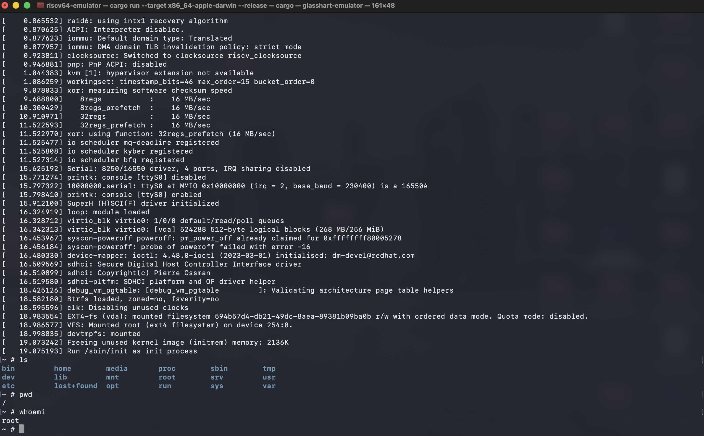
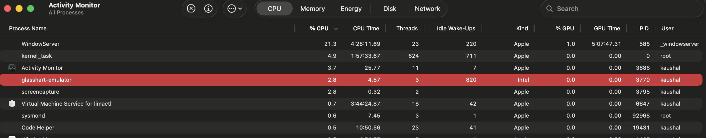

# RISCV Emulator in rust 🦀 - Glasshart-emulator

[](https://www.rust-lang.org/)
[](LICENSE)
[](#roadmap)
[](https://riscv.org/)

A 64-bit RISC-V emulator, written from scratch in Rust targeting RV64IMACFD, with the eventual goal of booting a real Linux distribution both natively and in the browser via WebAssembly.

> **Status:** coding incrementally with active performance profiling. Current milestone progress is tracked in the [Roadmap](#roadmap) below.

---
## 🤌 Linux Kernel Booting & Hyper-Optimizations

The emulator successfully initializes OpenSBI, boots a custom Linux 6.6 kernel, and mounts an Ext4 root filesystem via automated VirtIO-Block DMA transfers. 

By prioritizing micro-architectural profiling and fixing the interpreter hot paths, the end-to-end boot time is reduced from **over 60 seconds down to under 4 seconds**.

### 🛠️ Key Performance Implementations:
* **Instruction Decode Cache (L1i)**: Dramatically reduced fetch/decode overhead by using an instruction cache which stored decoded instruction pointers by PC, eliminating redundant decoding passes for a 25% reduction in total instruction decode volume.
* **Software TLB Caching**: Optimized virtual memory management by using cached TLB entries from the MMU to avoid costly multi-level page walks on subsequent page table walks.
Native Slice DMA: Eliminated slow byte-wise memory copies for VirtIO storage devices by performing slice extractions directly from the host’s memory space.
* **Hardware-Accurate `WFI` (Wait For Interrupt)**: Full implementation of the RISC-V idle state by using WFI to allow the emulator to yield execution back to the host when the Linux shell is in an idle state, reducing host CPU consumption to near 0% for guest cores.



*Efficient host CPU utilization under idle states:*



## Motivation behind taking this challenge

When I first came across [webvm.io](https://webvm.io/), I was fascinated how they have managed to get Linux running entirely in a web browser. At that time I had no idea how that was even possible, or how all the pieces fit together to make it work.

It's a great great project, but it only supports x86, and most modern packages have stopped shipping x86 binaries. I wanted to build something that could run a real 64-bit architecture one capable of running modern packages and languages partly to fill that gap, but mostly to satisfy my own curiosity about how all these components actually work together, and to learn something new in the process.

That's how I landed on RISC-V an open-source instruction set architecture, without decades of legacy baggage weighing it down the way x86 has.

It could have been enough for me to go through the specification from start to finish and be done with it. No, that wasn’t the point I wanted to experience the pain points, those things that you can only discover when writing a decoder and watching it do its thing wrong for hours

That's really the point of this project. Not just "an emulator that runs Linux," but a codebase where:

- The code stays readable enough that someone else learning RISC-V could open it up and follow along
- The end state is something genuinely fun to show off a real OS, booting inside a browser tab, running on an emulator I wrote myself

If you're also learning RISC-V or emulator internals, I'd genuinely love feedback or questions.

## Features
- [x] RV64IMAC - decoder base integer instruction set
- [X] RV64I - base integer instruction set
- [X] RV64M - multiply / divide
- [X] RV64C - compressed instructions
- [X] RV64A - atomics
- [X] RV64F/D - hardware floating point (single and double precision)
- [X] Privilege levels (M/S/U) and trap handling
- [X] CLINT - timer and software interrupts
- [X] PLIC - platform-level interrupt controller
- [X] UART (NS16550A) - serial console
- [X] SBI - Supervisor Binary Interface, OpenSBI boot support
- [X] Sv39 virtual memory - 3-level page table walker
- [X] TLB (Caching)
- [X] VirtIO block device
- [X] Boots a minimal Linux (Alpine) rootfs
- [X] VirtIO - network device (with GRO for high throughput)
- [X] WebAssembly build target - Linux, in a browser tab (with WebRTC internet access)

## Roadmap

I'm building this in deliberate, testable phases rather than jumping straight for "boot Linux and hope." Each phase has to be provably correct before I let myself move to the next one that's the only way I've found to keep bugs from stacking on top of each other.

| Phase | Milestone                                           | Status      |
| :---- | :-------------------------------------------------- | :---------- |
| 0     | instruction decoding                                |  Done       |
| 1     | Fetch–decode–execute skeleton                       |  Done       |
| 2     | Pass `riscv-tests` (`rv64ui` / `um` / `uc` / `ua`)  |  Done       |
| 3     | Privilege levels, trap/exception handling, CLINT    |  Done       |
| 4     | UART console, SBI implementation, OpenSBI boot      |  Done       |
| 5     | RV64F/D floating point (pass `rv64uf` / `ud` tests)  |  Done       |
| 6     | Sv39 MMU — page table walker, TLB                   |  Done       | 
| 7     | PLIC, VirtIO block device, Alpine rootfs boot       |  Done       |
| 8     | VirtIO network device (with GRO)                    |  Done       |
| 9     | WASM build, browser boot + WebRTC internet          |  Done       |

I'll keep this table updated as phases land - check the commit history or releases for the details behind each one.

## Architecture
I am heavily organizing it to make it scalable and easy to read. 
```
src/
├─ cpu/
│  ├─ execute/
│  │  ├─ csr_execute.rs
│  │  ├─ fp.rs
│  │  ├─ helper.rs
│  │  ├─ rv64a.rs
│  │  ├─ rv64d.rs
│  │  ├─ rv64f.rs
│  │  ├─ rv64i.rs
│  │  ├─ rv64m.rs
│  │  ├─ rv64u.rs
│  │  └─ system.rs
│  ├─ bus.rs
│  ├─ csr.rs
│  ├─ decoder_cache.rs
│  ├─ execute.rs
│  ├─ f_register.rs
│  ├─ memory.rs
│  └─ register.rs
├─ decode/
│  ├─ c_formats.rs
│  ├─ compressed.rs
│  ├─ f_formats.rs
│  ├─ formats.rs
│  ├─ rv32_64.rs
│  └─ rv64fd.rs
├─ devices/
│  ├─ virtio/
│  │  ├─ block.rs
│  │  ├─ config.rs
│  │  ├─ descriptor.rs
│  │  ├─ features.rs
│  │  ├─ mmio.rs
│  │  ├─ queue.rs
│  │  └─ request.rs
│  ├─ clint.rs
│  ├─ plic.rs
│  ├─ uart.rs
│  └─ virtio.rs
├─ mmu/
│  ├─ access_type.rs
│  ├─ address.rs
│  ├─ pte.rs
│  ├─ satp.rs
│  ├─ tlb.rs
│  ├─ translation.rs
│  └─ walker.rs
├─ cpu.rs
├─ decode.rs
├─ devices.rs
├─ instruction.rs
├─ lib.rs
├─ main.rs
├─ mmu.rs
├─ opcode.rs
└─ trap.rs
```

## Getting Started

### Prerequisites

- [Rust](https://rustup.rs/) (stable toolchain)
- A RISC-V cross-compiler toolchain, if you want to build your own test binaries (`riscv64-unknown-elf-gcc` or similar) [riscv-gnu-toolchain](https://github.com/riscv-collab/riscv-gnu-toolchain)

### Build

```bash
git clone https://github.com/kaushald4/glasshart-emulator.git
cd glasshart-emulator
cargo build --release
```

### Test

```bash
cargo test
```

## References

I'm building this directly against the primary sources rather than secondhand explanations — it's slower going, but it's the only way to actually trust the result:

- [RISC-V Unprivileged ISA Specification](https://docs.riscv.org/reference/isa/v20260120/unpriv/unpriv-index.html)
- [RISC-V Privileged Architecture Specification](https://docs.riscv.org/reference/isa/v20260120/priv/priv-index.html)
- [RISC-V SBI Specification](https://docs.riscv.org/reference/sbi/_attachments/riscv-sbi.pdf)
- [riscv-tests](https://github.com/riscv-software-src/riscv-tests)
- [OpenSBI](https://github.com/riscv-software-src/opensbi)

## A note on this repo

This is a personal learning project, but I'm holding it to the same bar I'd want from production code tested, documented, and honest about what does and doesn't work yet. If you spot something wrong or have a suggestion, I'm genuinely happy to hear it open an issue or reach out.

## Additional References

- [Tinyemu](https://github.com/dearchap/tinyemu)
- [QEMU](https://github.com/qemu/QEMU)
- [webvm](https://webvm.io/)
- [Softfloat_Wrapper](https://docs.rs/softfloat-wrapper/latest/softfloat_wrapper/)

## License

[MIT](LICENSE)
